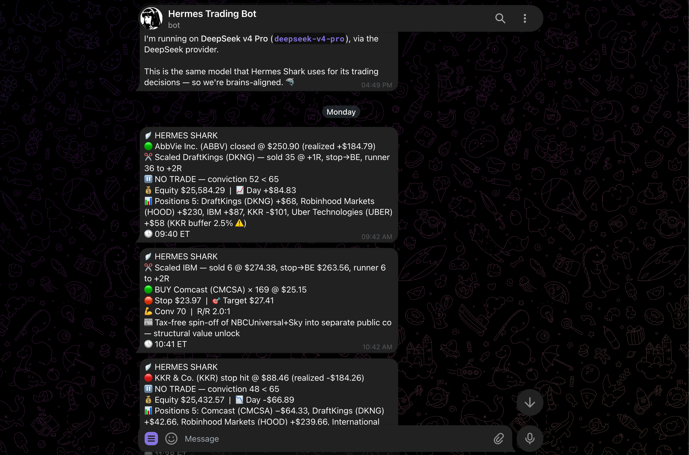
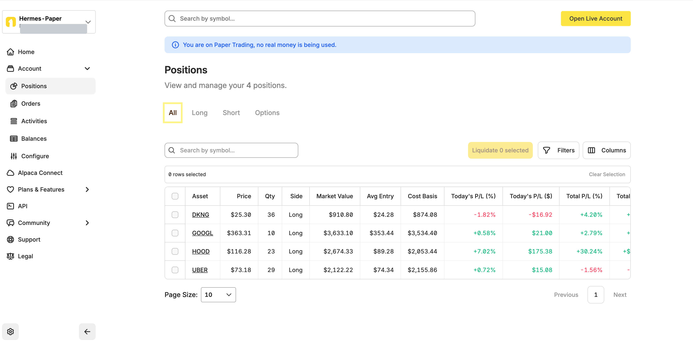

# Shark Trading Agent — Starter Kit


> **Stable presentation release: [v1.0.3](https://github.com/logiqfish/shark-trading-agent/releases/latest).** `main` is the live version you install; see **[Releases](https://github.com/logiqfish/shark-trading-agent/releases/latest)** for the frozen tagged package.

A skinny, **paper-only** trading bot you run on your own VPS as a **Hermes Agent profile
distribution**, with **two keys**. Unlike research/rating-only agent demos, **this one
actually trades** — with discipline:

> discover → bull/bear debate → conviction gate → bracketed entry → managed exit →
> self-grading journal → persistent thesis.

<p align="center">
  
</p>

<p align="center"><em>What it looks like running — conviction-gated entries, scaled exits, broker brackets, and live P&amp;L, pushed to your phone.</em></p>

<p align="center">
  
</p>

<p align="center"><em>…and the very same trades in your own Alpaca account — real positions, real live P&amp;L, <strong>paper money only</strong>. Not a backtest, not a rating: it places actual bracketed orders.</em></p>

<p align="center">
  
</p>

> [!TIP]
> **New here?** Read the 2-minute orientation → [docs/WHAT_YOU_GET.md](docs/WHAT_YOU_GET.md).

**Two keys, nothing else:**

1. **Alpaca (paper)** — market data *and* execution. Free at
   **[alpaca.markets](https://alpaca.markets/)** (use a **paper** account). We pick Alpaca
   because it's the only major broker with *free paper trading*; the same code retrofits to
   **[Robinhood](https://robinhood.com/us/en/agentic-trading)** (real money, via its Agentic
   Trading MCP) — see [Beyond stocks](#beyond-stocks-extending-it).
2. **An LLM** — the single trading brain. Via **[OpenRouter](https://openrouter.ai/)** you
   can swap brains (DeepSeek, Claude, GPT…) from one key; DeepSeek is a good, cheap default.

No hosted service, no mesh — it all runs on your box, your paper account, your risk. Read
**[DISCLAIMER.md](DISCLAIMER.md)** first, and **set a hard spending cap on your LLM account**
(an always-on agent can run up bills).

## What it does

- **Discovers** candidates from your watchlist (or [Alpaca](https://alpaca.markets/)'s
  most-actives) — Alpaca-only.
- **Debates** each candidate bull vs. bear and scores a 0–100 conviction.
- **Gates** every trade through a deterministic risk kernel (position size, cash reserve,
  R/R ≥ 2:1, −3% daily-loss halt, no averaging down, once-per-ticker).
- **Enters** with broker-side protection — primary path a GTC bracket (stop −1R, target
  +2R), fallback a market entry + separate GTC stop. Never naked; if a stop can't be
  confirmed, it liquidates.
- **Manages** exits in code: scales half at +1R, lifts the runner's stop to breakeven,
  rides to +2R.
- **Journals** every trade and self-grades it at exit (realized R + alpha vs SPY).
- **Remembers** each open position's thesis and flags it when the thesis breaks.

## What it does NOT do

**No news, earnings, or fundamentals feed** — it trades on price action + the LLM's judgment,
fenced to Alpaca + the LLM. The fence is enforced by the prompt, not a sandbox (the agent has
terminal access), so production-grade containment would add host/container egress controls.

This is the **skinny** build on purpose. The heavier version adds a live **data mesh** —
news & catalyst detection (**[Brave](https://brave.com/search/api/)**), deep source reads
(**[Firecrawl](https://firecrawl.dev/)**), paid **fundamentals / earnings / analyst** data,
SEC / 8-K monitoring, and a multi-pool **discovery engine** — as a separate hosted service,
not part of this kit. Want it? **[logiqfish.com](https://logiqfish.com)** or DM
**[@logiqfish](https://instagram.com/logiqfish)** on Instagram.

**Paper trading only. There is no live-trading path in this kit, by design.** *(You can
retrofit a live broker — e.g. **[Robinhood](https://robinhood.com/us/en/agentic-trading)** via
its Agentic Trading MCP — but that's a deliberate real-money extension, covered in
[Beyond stocks](#beyond-stocks-extending-it).)*

---

## What you're standing up (Hermes + a VPS)

- **Hermes** — an open-source, self-hosted **AI-agent runtime** by Nous Research. It gives
  the bot a persistent home (memory, skills, scheduler, chat channels) and a **browser
  dashboard**, so you never touch SSH. This kit ships *as* a Hermes profile.
  [Docs](https://hermes-agent.nousresearch.com/docs/) ·
  [source](https://github.com/nousresearch/hermes-agent).
- **A VPS** — a small, always-on cloud Linux box, so the bot keeps trading on schedule when
  your laptop is closed. We use **[Hostinger](https://www.hostinger.com/vps-hosting)** (it has
  a one-click *Hermes Agent* app), but any provider works.

---

## Install (all in your browser — no terminal of your own)

> [!IMPORTANT]
> **Order matters.** Install + activate the Shark profile **first**, *then* set keys / model /
> Telegram. Anything you configure before the profile is active binds to Hermes' **default**
> profile — the #1 setup failure. Fastest validated path:
> **[docs/FRIEND-SETUP.md](docs/FRIEND-SETUP.md)** · full walkthrough: **[SETUP.md](SETUP.md)**.

1. **Stand up Hermes on a small VPS.** On [Hostinger](https://www.hostinger.com/vps-hosting),
   pick the **one-click Hermes Agent** app; set an admin user/password (your dashboard login);
   wait ~5 min; then **Open app** → sign in → open the **App terminal** (a browser shell — no
   SSH). *(SETUP.md Phases 1–2.)*

2. **Install + activate the profile — first.** In the App terminal:
   ```
   hermes profile install github.com/logiqfish/shark-trading-agent -y
   hermes profile use shark-trading-agent
   ```
   **PROFILES** should now show `shark-trading-agent [active]`.

3. **Set the keys + model** (they bind to the active profile). The FILES page is
   download-only, so append **all** keys to the profile `.env` in the App terminal — include
   `ALPACA_BASE_URL` or the agent won't trade:
   ```
   printf 'ALPACA_API_KEY=PKxxxx\nALPACA_SECRET_KEY=xxxx\nALPACA_BASE_URL=https://paper-api.alpaca.markets\nOPENROUTER_API_KEY=sk-or-xxxx\n' >> /opt/data/profiles/shark-trading-agent/.env
   ```
   Then set the main model in **MODELS** → `deepseek/deepseek-v4-pro` (or any OpenRouter
   model). _Put the LLM key in the `.env`, **not** the KEYS page — the GUI can write it to the
   global env the profile ignores (details in [SETUP.md](SETUP.md))._

4. **(Optional) Telegram.** In **CHANNELS**, connect Telegram and enable it **for this
   profile** (not the default Hermes bot). Skip if you only want headless cron.

5. **Start the gateway** — nothing fires without it. In the container's App terminal:
   ```
   nohup hermes gateway run > /opt/data/gateway.log 2>&1 &
   ```
   Confirm **Gateway Status: Running**. _Use this, **not** the dashboard's "Restart Gateway"
   button (it hangs); re-run after a container restart. Host-vs-container tip + full notes in
   [SETUP.md](SETUP.md)._

6. **Smoke-test.** In **CHAT** (or Telegram): *"Run the shark skill now for a single fire."*
   You'll see it read the regime, debate a candidate, and — if it trades — place a
   broker-protected paper entry + a journal slip. Confirm the order in Alpaca.

7. **Schedule the scan (CLI)** — the shipped cron is a template, not auto-registered:
   ```
   hermes cron create '0 14,17,19 * * 1-5' 'Run the Shark trading routine for this fire. Follow the `shark` skill procedure exactly, in order. Emit only the final one-line status card summarizing the fire (trade or no-trade). Always emit the card and never respond with [SILENT], so every fire posts a status card.' --name weekday-trading --skill shark --deliver local
   ```
   No `--timezone` flag → runs in **UTC**: `14,17,19` = **10 AM / 1 PM / 3 PM ET (EDT)**; use
   `15,18,20` in winter (EST). Verify: `hermes cron list`. For Telegram cards: **send
   `/sethome` in the target chat** (else the bot chats fine but scheduled fires deliver
   nowhere — the #1 "looks dead" gotcha) + `--deliver telegram`. *(Details in
   [SETUP.md](SETUP.md).)*

8. **(Optional) Gut trades — the bot as your "second brain."** DM a real ticker and it
   pressure-tests your pick before any money moves:
   > **You:** take NVDA
   > **Bot:** 🦈 Shark brain on NVDA: conviction 71/100 · regime OK — I'd place 12 sh @
   > ~$168.40 · stop $162.10 · target $181.00 (+2R) · 8%. Override and take it? (yes / no)

   Same risk kernel as the scan; it shows what it *would* place, but **nothing is bought until
   you reply `yes`**. Pin your own stop with `take NVDA stop 162`.

**Updating:** `hermes profile update` re-pulls the SOUL/skill/cron. Your runtime state
(journal, theses, portfolio) is excluded, so updates never wipe your history.

> **Cost guard.** Always-on agent → set a hard spending cap on your LLM account first. It
> fires ~3×/day on weekday market hours only — but cap it anyway.

---

## Beyond stocks? (extending it)

The interesting part here isn't "AI picks stocks" — it's the **containment pattern**: LLM
reasoning boxed by a **deterministic risk kernel**, behind a **pluggable execution adapter**
(`skills/shark/scripts/trade-manager/execution_adapter.py`). That pattern isn't specific to
equities.

Porting it to another venue — a different broker, crypto, or an instrument with a
fundamentally different payoff (say a binary, resolution-based contract) — means writing a
new execution adapter **and** a risk model that fits that payoff. It's a real extension, not
a config flag: a resolution-based contract has no `−1R` stop or `+2R` bracket, so the kernel
would be *rethought*, not reused. **This kit ships equities-on-Alpaca only** — the
transferable part is the design, not a ready-made mode for any other instrument.

### Retrofitting to a live broker (Robinhood)

Staying in equities but swapping the venue is the *easy* kind of port — same risk kernel, same
bracket/exit model, just a new adapter behind the same seam. Robinhood now exposes an
**[Agentic Trading MCP](https://robinhood.com/us/en/agentic-trading)** (agents connect to its
Model Context Protocol server against a dedicated *agentic account*). To target it you'd write a
`RobinhoodMcpAdapter` implementing the same `ExecutionAdapter` interface as
`LegacyAlpacaRestAdapter`, mapping the kit's place-order / list-positions / cancel / reconcile
calls onto Robinhood's MCP tools (`place_equity_order`, `get_equity_positions`,
`cancel_equity_order`, …) and translating the bracket/OCO exit model onto whatever that account
supports. The deterministic risk kernel stays fail-closed **above** the adapter exactly as it
does today — the LLM never holds broker write tools directly.

**Why the kit ships Alpaca and not Robinhood:** Alpaca is the only major broker with a **free
paper account** (real quotes, simulated fills, *zero dollars at risk*), and this kit is
**paper-only by design** — a bug is a pretend mistake, safe to hand to a stranger. Robinhood's
agentic account is a **real brokerage account with real money and no paper/sandbox mode**, so a
Robinhood retrofit is a deliberate step into live trading, not a swapped config value. The kit
even refuses to go live *by construction*: `broker.py` rejects any non-paper base at every order
site (`"paper" not in adapter.base` → fail-closed), so a live retrofit means consciously lifting
that guard. If you do: validate the adapter against Alpaca paper first, keep the risk kernel
above the rail, respect Robinhood's own per-trade approval controls, and do your own guardrail +
regulatory homework before a single real order. That's the whole reason it's an opt-in
extension — **this kit stays paper-only.**

---

## Running the tests

The risk kernel and every skill ship **stdlib-only** tests (no extra deps). Run them **per
skill directory** — a repo-root `pytest` fails to collect because each skill has its own
`tests/` package (duplicate module names), so point pytest at one at a time:

```
cd skills/shark/scripts/risk && python3 -m pytest tests/ -q      # the risk kernel — 127 tests
```

Repeat for any skill under `skills/shark/scripts/*` (`risk`, `trade-manager`, `debate`,
`discretionary`, `reflection`, `thesis`, `local-markov`, `discovery-local`, `alpaca`).

---

See also: [SETUP.md](SETUP.md) (full provisioning) · [FRIEND-SETUP.md](docs/FRIEND-SETUP.md)
(non-technical path) · [DISCLAIMER.md](DISCLAIMER.md) · [LICENSE](LICENSE).
